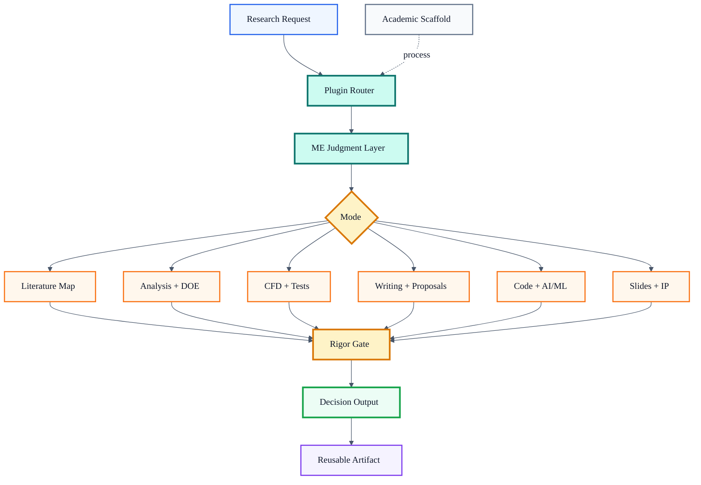

# Thermal-Fluid Research Workflow Plugin

[English](README.md) | [简体中文](README.zh-CN.md) | [繁體中文](README.zh-TW.md)

**A domain-rigor layer for thermal-fluid mechanical engineering research with AI agents.**

Generic research agents can summarize papers and draft prose. This plugin helps them do the harder mechanical-engineering work: check heat-transfer and fluid-flow assumptions, catch invalid correlation use, question CFD validation, protect uncertainty analysis, explain mechanisms, and turn evidence into decision-ready research artifacts.

Use it when a thermal-fluid answer needs to be physically defensible, not just well written.

[](CHANGELOG.md)
[](.codex-plugin/plugin.json)
[](.claude-plugin/plugin.json)
[](skills/mechanical-engineering-research/SKILL.md)
[](#what-it-catches)
[](LICENSE)
[](https://github.com/hanhuark/mechanical-engineering-research-skill/stargazers)

If this helps your research workflow, please star the repo so other mechanical-engineering researchers can find it.

Want the fastest path? Start with [`QUICKSTART.md`](QUICKSTART.md).

## Two-Minute Demo

Paste a prompt like this after installing the skill:

```text
Use the mechanical-engineering-research skill to review this claim:

"The CFD model proves that the new microchannel heat sink is optimal because
the average Nusselt number is 40% higher than the baseline. The simulation used
k-epsilon turbulence, a coarse wall mesh, constant water properties, and three
flow rates between Re = 350 and 900. Pressure drop is not discussed."
```

Expected style of response:

```text
Bottom line: The claim is overconfident. The result may indicate better heat
transfer in the tested cases, but it does not prove optimality.

Key issues:
- Re = 350-900 may be laminar or transitional for the stated geometry, so a
  k-epsilon turbulence model needs justification.
- A coarse wall mesh weakens confidence in wall heat flux and Nusselt number.
- Constant water properties may be acceptable only over a small temperature
  range; the temperature span must be stated.
- A 40% Nusselt increase is incomplete without pressure drop, pumping power,
  and thermal resistance.
- "Optimal" requires a design space, objective function, constraints, and
  uncertainty or grid-independence evidence.

Next checks: compare against laminar correlations or a conjugate heat-transfer
baseline, report y+ or wall treatment, run mesh independence, include pressure
drop and pumping power, and rewrite the claim as evidence from a limited CFD
study rather than proof of global optimality.
```

## Workflow



Editable Mermaid source: [`assets/workflow.mmd`](assets/workflow.mmd).

## What It Catches

- Correlations used outside their Reynolds, Prandtl, geometry, roughness, orientation, or phase-change validity range.
- CFD claims without mesh independence, wall treatment, convergence, boundary-condition, property-model, or validation evidence.
- Experiment plans missing sensor calibration, uncertainty propagation, repeatability, heat-loss correction, or flow-development checks.
- AI/ML workflows with leakage across videos, surfaces, experiments, geometries, pressures, or simulation families.
- Literature reviews that list papers chronologically instead of synthesizing mechanisms, methods, gaps, and benchmark evidence.
- Proposal sections that describe ambitious methods but do not connect barrier, capability, validation, metrics, risk, and impact.
- Results discussions that report trends without explaining the dominant physics.

## Quick Install

### OpenAI Codex

Ask Codex to install the plugin from GitHub:

```text
Install the Codex plugin from https://github.com/hanhuark/mechanical-engineering-research-skill
```

If your Codex environment does not yet support community plugin installation from a GitHub repo, install the skill folder directly:

```text
Install the Codex skill from GitHub repo hanhuark/mechanical-engineering-research-skill, path skills/mechanical-engineering-research.
```

Manual install on Windows:

```powershell
git clone https://github.com/hanhuark/mechanical-engineering-research-skill.git
cd mechanical-engineering-research-skill
Copy-Item -Recurse .\skills\mechanical-engineering-research "$env:USERPROFILE\.codex\skills\mechanical-engineering-research" -Force
```

### Claude Code

Clone the repository and launch Claude Code with the plugin directory:

```bash
git clone https://github.com/hanhuark/mechanical-engineering-research-skill.git
claude --plugin-dir ./mechanical-engineering-research-skill
```

Then invoke one of the workflow prompts, for example:

```text
/thermal-fluid-research-workflow:me-cfd-review
/thermal-fluid-research-workflow:me-correlation-check
/thermal-fluid-research-workflow:me-figure-discussion
```

## Use With Generic Academic Workflows

This plugin does not replace broad academic-research tools. Use generic academic workflows for process scaffolding: outline, citation management, drafting sequence, peer-review loop, and finalization. Use this plugin when the work depends on thermal-fluid validity: regimes, assumptions, correlations, property variation, scaling, CFD credibility, experiment design, uncertainty, and engineering tradeoffs.

```text
academic research workflow = process scaffold
mechanical-engineering-research = thermal-fluid domain judgment layer
```

## Workflow Prompts

| Prompt | Use |
|---|---|
| [`me-correlation-check.md`](commands/me-correlation-check.md) | Check whether equations, correlations, and dimensionless groups are being used within valid limits. |
| [`me-cfd-review.md`](commands/me-cfd-review.md) | Review CFD setup, mesh, wall treatment, convergence, validation, and claim strength. |
| [`me-experiment-plan.md`](commands/me-experiment-plan.md) | Plan thermal-fluid experiments around instrumentation, calibration, uncertainty, repeatability, and safety. |
| [`me-lit-matrix.md`](commands/me-lit-matrix.md) | Build a mechanism-based literature matrix with methods, metrics, validity limits, and gaps. |
| [`me-figure-discussion.md`](commands/me-figure-discussion.md) | Turn a figure into a physical explanation with claims, comparisons, and limitations. |
| [`me-proposal-aims.md`](commands/me-proposal-aims.md) | Rewrite aims around barrier, hypothesis, approach, metrics, risk, and impact. |
| [`me-code-sanity.md`](commands/me-code-sanity.md) | Review research code for units, reproducibility, leakage, baselines, and physics checks. |
| [`me-lit-review.md`](commands/me-lit-review.md) | Develop a critical thermal-fluid literature review and gap synthesis. |
| [`me-proposal.md`](commands/me-proposal.md) | Develop or revise a solicitation-aligned research proposal. |
| [`me-write-section.md`](commands/me-write-section.md) | Draft or revise manuscript, proposal, report, or thesis sections. |
| [`me-data-analysis.md`](commands/me-data-analysis.md) | Plan baseline-first thermal-fluid data analysis and hypothesis-driven DOE. |
| [`me-build-slides.md`](commands/me-build-slides.md) | Build graphics-first research presentations and speaker notes. |
| [`me-code-review.md`](commands/me-code-review.md) | Review and refactor reproducible thermal-fluid research code. |

## Showcase

The examples are synthetic, public-safe artifacts designed to show the plugin's expected behavior:

| Artifact | What it demonstrates |
|---|---|
| [`cfd-review-memo.md`](examples/showcase/cfd-review-memo.md) | How to downshift overclaimed CFD evidence into a defensible review memo. |
| [`heat-exchanger-design-matrix.md`](examples/showcase/heat-exchanger-design-matrix.md) | How to compare design options by mechanism, pressure drop, manufacturability, and risk. |
| [`boiling-literature-matrix.md`](examples/showcase/boiling-literature-matrix.md) | How to synthesize a boiling literature review by mechanism rather than paper order. |
| [`proposal-aims-rewrite.md`](examples/showcase/proposal-aims-rewrite.md) | How to convert vague proposal aims into reviewer-ready technical aims. |
| [`figure-discussion-before-after.md`](examples/showcase/figure-discussion-before-after.md) | How to rewrite a weak results paragraph into a physical explanation. |

## Capabilities

| Area | What the plugin helps with | Reference |
|---|---|---|
| Research workflow | Source-aware thermal-fluid research, assumptions, correlations, trade studies, validation | [`SKILL.md`](skills/mechanical-engineering-research/SKILL.md) |
| Literature review | Critical review, seminal-work tracing, citation path, review figures, benchmark tables | [`literature-review.md`](skills/mechanical-engineering-research/references/literature-review.md) |
| Paper writing style | Abstracts, methods, figure-led results, conclusions, AI/ML paper style | [`paper-writing-style.md`](skills/mechanical-engineering-research/references/paper-writing-style.md) |
| Technical writing | Methodology detail, modeling assumptions, results discussion | [`technical-writing-analysis.md`](skills/mechanical-engineering-research/references/technical-writing-analysis.md) |
| Proposal development | DOE/NSF/NASA-style narratives, solicitation alignment, milestones, risks | [`proposal-development.md`](skills/mechanical-engineering-research/references/proposal-development.md) |
| Research coding | Reproducible scripts, notebooks, plotting, simulation automation, code review | [`research-coding.md`](skills/mechanical-engineering-research/references/research-coding.md) |
| Presentations | Graphics-first research talks, slide logic, speaker notes, backup slides | [`presentation-slides.md`](skills/mechanical-engineering-research/references/presentation-slides.md) |
| AI/ML tools | BubbleID, SeqReg, CFDTwin, DataDroid-LAM, sensor fusion, surrogate modeling | [`ai-tools-thermal-fluids.md`](skills/mechanical-engineering-research/references/ai-tools-thermal-fluids.md) |
| Toolchain | Overleaf, VS Code, GitHub, git, releases, reproducibility hygiene | [`research-toolchain.md`](skills/mechanical-engineering-research/references/research-toolchain.md) |
| Innovation | Invention disclosure, patent-support packets, commercialization briefs | [`innovation-commercialization.md`](skills/mechanical-engineering-research/references/innovation-commercialization.md) |

## Validation

Run repository validation:

```powershell
python scripts\validate_repo.py
```

Optional local Codex/plugin validation:

```powershell
python "$env:USERPROFILE\.codex\skills\.system\skill-creator\scripts\quick_validate.py" ".\skills\mechanical-engineering-research"
python "$env:USERPROFILE\.codex\skills\.system\plugin-creator\scripts\validate_plugin.py" "."
```

The CI workflow in [`.github/workflows/validate.yml`](.github/workflows/validate.yml) runs the repository validation script and checks the thermal-fluid eval fixtures.

## Release Notes

See [`CHANGELOG.md`](CHANGELOG.md). The `v0.2.0` release line adds the public-positioning refresh, workflow diagram, showcase examples, micro-workflows, validation fixtures, CI, and bilingual README files.

## Related Tools

| Tool | Use |
|---|---|
| [BubbleID](https://github.com/cldunlap73/BubbleID) | Computer vision for bubble and interface dynamics |
| [SeqReg](https://github.com/cldunlap73/SeqReg) | Sequence regression for boiling and sensor data |
| [CFDTwin](https://github.com/UARK-NED3/CFDTwin) | CFD surrogate modeling and digital-twin workflows |
| [DataDroid-LAM](https://github.com/spier16/DataDroid-LAM) | Lab analysis and automation tooling |
| [MEEG-54403](https://github.com/hanhuark/MEEG-54403) | Machine Learning for Mechanical Engineers course material |

## Contributing

Contributions are welcome when they improve reusable thermal-fluid research practice: stronger validity checks, better examples, clearer workflows, more robust eval fixtures, or better installation documentation. See [`CONTRIBUTING.md`](CONTRIBUTING.md).

## License

MIT License. See [`LICENSE`](LICENSE).
